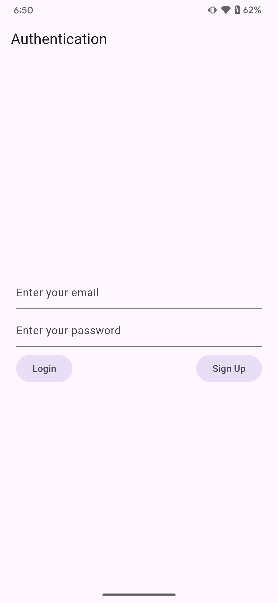
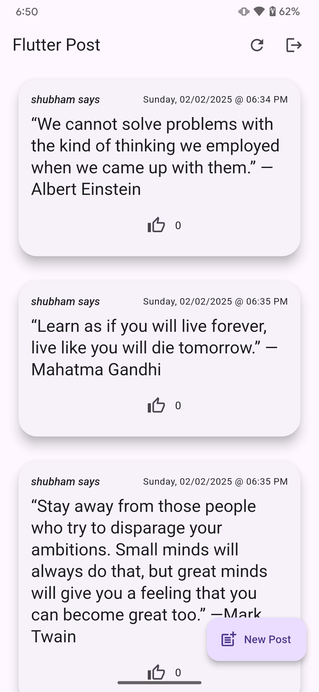
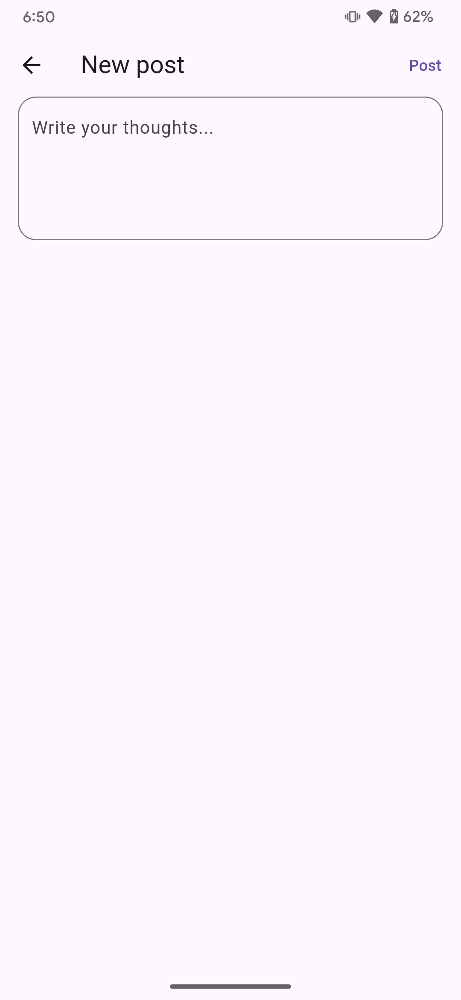

# flutter_post

Your mini social-media stop shop.

## Demo

https://github.com/user-attachments/assets/b6d0bb09-d56d-4e2a-a5f9-2089948b78f2

## Screenshots

> **Note:** A demo build named `app-release.apk` is available inside the `demo_build` package.
Install it to quickly be able to use the app without having to build the project.

  

## Getting Started

The project was created using Flutter `3.27.2` and Dart `3.6.1`.

This project uses `Firebase`, hence you need to add the following files (should be provided to you
locally by the candidate as an attachment in his code-submission email) at the given locations:

1. `firebase.json` - `root/firebase.json`
2. `firebase_options.dart` - `root/lib/firebase_options.dart`
3. `google-services.json` - `root/android/app/google-services.json`
4. `GoogleService-Info.plist` - `root/ios/Runner/GoogleService-Info.plist`
5. `GoogleService-Info.plist` - `root/macos/Runner/GoogleService-Info.plist`

Although all generated files have been checked into the VCS, but just in case you find yourself
in a situation where you have to generate code to fix any project-related problems, execute the
following commend from your terminal instance:

```
dart run build_runner watch --delete-conflicting-outputs
```

Some code inside `main.dart` has been intentionally commented out to make sure that you don't have
to set up Firebase emulators before being able to execute the project successfully. Uncomment that
code if you want to test on local Firebase emulators.
